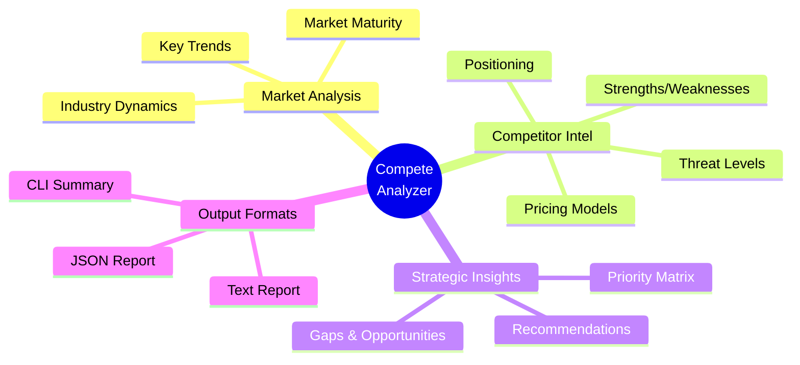

<div align="center">

```
                                                                                
     ██████╗ ██████╗ ███╗   ███╗██████╗ ███████╗████████╗███████╗               
    ██╔════╝██╔═══██╗████╗ ████║██╔══██╗██╔════╝╚══██╔══╝██╔════╝               
    ██║     ██║   ██║██╔████╔██║██████╔╝█████╗     ██║   █████╗                 
    ██║     ██║   ██║██║╚██╔╝██║██╔═══╝ ██╔══╝     ██║   ██╔══╝                 
    ╚██████╗╚██████╔╝██║ ╚═╝ ██║██║     ███████╗   ██║   ███████╗               
     ╚═════╝ ╚═════╝ ╚═╝     ╚═╝╚═╝     ╚══════╝   ╚═╝   ╚══════╝               
                                                                                
          █████╗ ███╗   ██╗ █████╗ ██╗  ██╗   ██╗███████╗███████╗██████╗        
         ██╔══██╗████╗  ██║██╔══██╗██║  ╚██╗ ██╔╝╚══███╔╝██╔════╝██╔══██╗       
         ███████║██╔██╗ ██║███████║██║   ╚████╔╝   ███╔╝ █████╗  ██████╔╝       
         ██╔══██║██║╚██╗██║██╔══██║██║    ╚██╔╝   ███╔╝  ██╔══╝  ██╔══██╗       
         ██║  ██║██║ ╚████║██║  ██║███████╗██║   ███████╗███████╗██║  ██║       
         ╚═╝  ╚═╝╚═╝  ╚═══╝╚═╝  ╚═╝╚══════╝╚═╝   ╚══════╝╚══════╝╚═╝  ╚═╝       
                                                                                
```


<br/>

[](https://python.org)
[](https://groq.com)
[](LICENSE)
[](https://github.com/yourusername/compete-analyzer)

<br/>


</div>

<br/>

##  What is This?

**Compete Analyzer** is a CLI-based AI agent that transforms your competitive landscape into actionable strategic insights. Powered by Groq's blazing-fast LLaMA 3.3 70B model, it delivers enterprise-grade competitive analysis in seconds.

<div align="center">
<table>
<tr>
<td align="center">

<br/><b>Lightning Fast</b>
<br/><sub>Groq's LPU delivers<br/>500+ tokens/sec</sub>
</td>
<td align="center">

<br/><b>100% Free</b>
<br/><sub>No OpenAI costs<br/>Groq API is free</sub>
</td>
<td align="center">

<br/><b>Strategic Depth</b>
<br/><sub>SWOT, gaps, threats<br/>& recommendations</sub>
</td>
<td align="center">

<br/><b>Beautiful Output</b>
<br/><sub>JSON + formatted<br/>text reports</sub>
</td>
</tr>
</table>
</div>

<br/>

##  Live Demo

<div align="center">

```
╔═══════════════════════════════════════════════════════════════╗
║                                                               ║
║   ⚔️  COMPETITIVE ANALYSIS AGENT                              ║
║                                                               ║
║   Powered by Groq AI • Strategic Intelligence Engine          ║
║                                                               ║
╚═══════════════════════════════════════════════════════════════╝

────────────────────────────────────────────────────────────
  INITIALIZATION
────────────────────────────────────────────────────────────

  ✓ Found saved API key: gsk_N2T6...urco
  ✓ Groq client initialized
  ✓ Loaded analysis context from input.txt

────────────────────────────────────────────────────────────
  RUNNING ANALYSIS
────────────────────────────────────────────────────────────

  ◉ Analyzing market landscape...
  ◉ Evaluating competitor positions...
  ◉ Identifying strategic gaps...

  Using model: llama-3.3-70b-versatile
  Generating insights...

  ................................................................

  ✓ Analysis complete!

────────────────────────────────────────────────────────────
  ANALYSIS SUMMARY
────────────────────────────────────────────────────────────

  Industry: Online education
  Market Maturity: Growth stage

  Competitors Analyzed: 4
    • Coursera [Medium]
    • Zapier Academy [Low]
    • Time management gurus [Low]
    • Bootcamp-style AI programs [Medium]

  Opportunities Identified: 3
  Strategic Recommendations: 3

  Positioning:
  "The AI Agent Productivity Course is a unique, practical..."

  ✓ Analysis complete!
  Check competitive_analysis.json and competitive_analysis.txt
```

</div>

<br/>

##  Features

<div align="center">



</div>

### Analysis Framework

| Component | Description |
|:----------|:------------|
| **Market Overview** | Industry dynamics, trends, and maturity assessment |
| **Company Profile** | Your value proposition, segments, and positioning |
| **Competitor Deep-Dive** | Strengths, weaknesses, pricing, threat levels |
| **Competitive Matrix** | Differentiation factors, advantages, vulnerabilities |
| **Gaps & Opportunities** | Market gaps with priority and difficulty ratings |
| **Strategic Recommendations** | Actionable insights with rationale and expected impact |
| **Positioning Statement** | Clear, compelling market positioning |

<br/>

##  Quick Start

### Prerequisites

- Python 3.8+
- Free Groq API key ([Get one here](https://console.groq.com))

### Installation

```bash
# Clone the repository
git clone https://github.com/yourusername/compete-analyzer.git
cd compete-analyzer

# Create virtual environment
python -m venv venv
source venv/bin/activate  # On Windows: venv\Scripts\activate

# Install dependencies
pip install groq
```

### Usage

**1. Configure your analysis context in `input.txt`:**

```text
Primary Company: Your Company Name
Industry: Your Industry

Description:
Brief description of what your company does...

Competitors:
- Competitor 1
- Competitor 2
- Competitor 3

Target Audience:
Who you're targeting...

Key Questions:
1. What makes us different?
2. Where are competitors weak?
3. What gaps can we exploit?

Focus Areas:
- Differentiation
- Positioning strategy
- Market opportunities
```

**2. Run the agent:**

```bash
python agent.py
```

**3. Enter your Groq API key when prompted (saved for future use)**

**4. Get your reports:**
- `competitive_analysis.json` - Structured data
- `competitive_analysis.txt` - Formatted report

<br/>

##  Output Structure

<details>
<summary><b>Click to expand JSON schema</b></summary>

```json
{
  "market_overview": {
    "industry": "string",
    "market_dynamics": "string",
    "key_trends": ["array"],
    "market_maturity": "string"
  },
  "primary_company": {
    "name": "string",
    "core_value_proposition": "string",
    "target_segments": ["array"],
    "current_positioning": "string"
  },
  "competitors": [
    {
      "name": "string",
      "category": "string",
      "strengths": ["array"],
      "weaknesses": ["array"],
      "pricing_model": "string",
      "target_audience": "string",
      "positioning": "string",
      "threat_level": "High | Medium | Low"
    }
  ],
  "competitive_matrix": {
    "differentiation_factors": ["array"],
    "competitive_advantages": ["array"],
    "vulnerabilities": ["array"]
  },
  "gaps_and_opportunities": [
    {
      "gap": "string",
      "opportunity": "string",
      "priority": "High | Medium | Low",
      "implementation_difficulty": "High | Medium | Low"
    }
  ],
  "strategic_recommendations": [
    {
      "recommendation": "string",
      "rationale": "string",
      "expected_impact": "string"
    }
  ],
  "positioning_statement": "string"
}
```

</details>

<br/>

##  Tech Stack

<div align="center">

| Technology | Purpose |
|:----------:|:--------|
|  | Core runtime |
|  | Lightning-fast LLM inference |
|  | State-of-the-art language model |

</div>

<br/>

##  Why Compete Analyzer?

<div align="center">

| Traditional Approach | Compete Analyzer |
|:--------------------:|:----------------:|
| Hours of manual research | **Seconds** of AI analysis |
| Expensive consulting fees | **100% Free** with Groq |
| Subjective opinions | **Data-driven** insights |
| Static reports | **Dynamic** re-analysis |
| Generic templates | **Tailored** to your context |

</div>

<br/>

##  Roadmap

- [x] Core competitive analysis engine
- [x] Streaming output with progress
- [x] API key persistence
- [x] Multi-model fallback
- [ ] Web scraping for real-time competitor data
- [ ] PDF report generation
- [ ] Slack/Discord integration
- [ ] Scheduled re-analysis

<br/>

##  Contributing

Contributions are welcome! Feel free to:

1. Fork the repository
2. Create a feature branch (`git checkout -b feature/amazing-feature`)
3. Commit your changes (`git commit -m 'Add amazing feature'`)
4. Push to the branch (`git push origin feature/amazing-feature`)
5. Open a Pull Request

<br/>

##  License

This project is licensed under the MIT License - see the [LICENSE](LICENSE) file for details.

<br/>

<div align="center">

---


###  Made with AI, for strategists who think ahead

**[Report Bug](https://github.com/yourusername/compete-analyzer/issues)** · **[Request Feature](https://github.com/yourusername/compete-analyzer/issues)** · **[Star this repo](https://github.com/yourusername/compete-analyzer)**

<br/>

<a href="https://github.com/yourusername/compete-analyzer">
  
</a>

</div>
